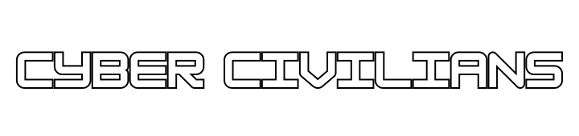

# ⚔️ **Cyber Civilians**

> **A fast-paced educational arcade game about defending cyberspace with water balloons, code, and crates.**

---

  

---

## 🎮 **Overview**

**Cyber Civilians** is a **2D educational action-defense game built using Python and Pygame.**  
You play as a **digital defender in a futuristic cyberpunk world, tasked with fighting off waves of rogue AIs using water-based projectiles, traps, and coding knowledge.**  

**Answer trivia questions to boost your power and unlock upgrades!**  
**It's a unique mix of learning and fun designed by and for the next generation of coders.**

---

## 🧩 **Game Features**

- 🧠 **Educational Trivia** – **Python and cybersecurity questions that power up your abilities**  
- 💥 **Action Mechanics** – **Use crates, projectiles, and explosive barrels to fight back**  
- 👾 **Enemy Waves** – **Increasing difficulty with random spawns**  
- 🦾 **Boss Battles** – **Intense fights with cyber bosses (spawned after 2400 frames)**  
- 🎮 **Controller-Like Keyboard Support**  
- 🎨 **Cyberpunk Visuals** – **Assets ready for your friend to customize**  
- 🔊 **Sound FX Ready** – **Water splashes, explosions, and power-up sounds**  
- 📈 **HUD System** – **Track health, score, ammo, and toggle trivia mode**  

---

## 🕹️ **Controls**

| **Action**                  | **Key / Mouse**           |
|----------------------------|--------------------------|
| **Move**                   | **`W` `A` `S` `D`**      |
| **Shoot (Water Balloon)**  | **Left Mouse Button**     |
| **Place Crate**            | **`Spacebar`**           |
| **Place Explosive Crate**  | **Right Mouse Button**    |
| **Toggle Question Screen** | **`Left Shift`**         |

---

## 🛠️ **How to Run**

### ✅ **Requirements**

- **Python 3.8 or higher**  
- **Pygame (tested on 2.x)**  

### 🔧 **Install Dependencies**


##👨‍💻 **Made By**
Aaryan Dwivedi and Om Gagrani are co-founders and co-lead programmers of Cyber Civilians.
We equally shared the vision, designed the core gameplay, coded the mechanics, and crafted the art assets.
This project is the result of our collaborative passion and teamwork from concept to completion.

```bash
pip install pygame